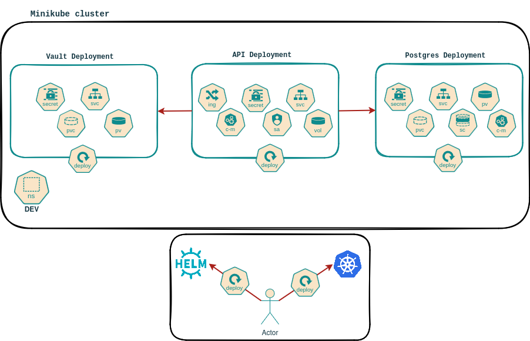

# Project

## Summary

- [Introduction](#introduction)
- [Project Structure](#project-structure)
- [Architecture Diagram](#architecture-diagram)
- [Deployment](#deployment)
  - [Using Docker](#using-docker)
  - [Using Kubernetes & Helm](#using-kubernetes--helm)
- [Running Tests](#running-tests)

## Introduction
This project is a Python-based API application designed to handle authentication and data management. It is built using modern web development practices, including FastAPI, SQLAlchemy for database interactions, and Pydantic for data validation. The application is containerized using Docker and can be deployed to a Kubernetes cluster with Helm charts. It also integrates with Vault for secret management and PostgreSQL as the database



## Project Structure
```
.
├── app
│   ├── api                 # API endpoints
│   │   ├── endpoints       # Authentication & Data Endpoints
│   ├── core                # Core configuration and security settings
│   ├── db                  # Database models and sessions
│   ├── schemas             # Data schemas for API requests and responses
│   ├── utils               # Utility functions (e.g., logging)
│   ├── main.py             # Main entry point for the application
├── Dockerfile              # Docker configuration
├── helm                    # Helm chart for deployment
│   ├── api-chart           # Helm chart for the API
│   ├── templates           # Kubernetes resource templates
├── k8s                     # Kubernetes deployment configurations
│   ├── api                 # API-related deployments & services
│   ├── postgres            # PostgreSQL deployment
│   ├── vault               # Vault configuration
│   ├── namespace           # Kubernetes namespace
├── scripts                 # Helper scripts
│   ├── migrate_db.py       # Database migration script
│   ├── start.sh            # Startup script
├── tests                   # Unit and integration tests
│   ├── test_auth.py        # Authentication tests
│   ├── test_data.py        # Data handling tests
├── requirements.txt        # Python dependencies
├── run_deploy.sh           # Script to deploy the project
├── run_destroy.sh          # Script to remove deployments
├── run_docker.sh           # Script to build and run Docker container
├── run_vault-configuration.sh # Vault configuration script
├── run_vault-init_unseal.sh   # Vault initialization and unsealing script
├── pytest.ini              # Pytest configuration
└── README.md               # Project documentation
```

## Architecture Diagram
```
        +---------------------+
        |      Client         |  <-- 🔹 The user sends an HTTP request to the API
        +---------------------+
                |
                v
        +---------------------+
        |       API           |  <-- 🔹 FastAPI Backend  
        | FastAPI Backend     |      - Receives the client request  
        |                     |      - Handles authentication &     authorization  
        |                     |      - Connects to Vault for credentials  
        +---------------------+
                   |       \
                   |        \ 
                   v         v
+---------------------+      +---------------------+
|     Vault           |      |   PostgreSQL DB     |
| Secret Management   |      |   Database Storage  |
| - API retrieves     |      | - Stores application|
|   database creds    |      |   data securely     |
+---------------------+      +---------------------+

```
## Deployment  

### Using Docker  
Docker is used only to build images and push them to the repository. The deployment is handled by Kubernetes.  

To build and run the application using Docker:  
```sh
./run_docker.sh
```  

### Using Kubernetes & Helm  
To deploy the application in a Kubernetes cluster, use the following script. It accepts a parameter to specify whether you want to use Helm or kubectl:  
```sh
./run_deploy.sh helm  
```  

Run this script to unseal the Vault:  
```sh
./run_vault-init_unseal.sh  
```  

Next, run this script to configure the Vault:  
```sh
./run_vault-configuration.sh  
```  

To destroy the deployment, use this script and specify whether to use Helm or kubectl:  
```sh
./run_destroy.sh helm
```  

## Running Tests  
To run unit tests:  
```sh
pytest tests/  
```


